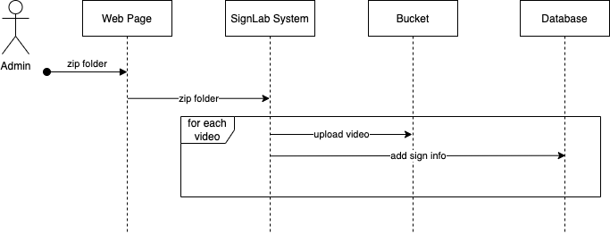

===========================
SignLab Technical Use Cases
===========================

.. role:: missing-info

Introduction
============

This document goes over use cases of SignLab and how the general flow of
operation takes place. The idea is to capture user groups, how data flows,
and where various software components can be distilled. Additional documents
highlight specifically these use cases are implemented in code, but this one
focuses on high level features.

Project Setup
=============

A project owner will have the ability to provide initial configuration for
how the project will be configured for use. These settings will be applied once
and will determine how the rest of the application works.

:missing-info:`Determine how this configuration will take place`

User Login
==========

When any user first reaches the homepage they will login in with their
pre-existing credentials. These credentials determine the user class(es)
that the user belongs to.

Admin Video Upload
==================

An admin has the ability to access an upload interface which allows them to
push videos into the SignLab database which users will later tag. Doing so
will have the videos stored in an area accessible to SignLab and will upload
the current state of the database to include the newly uploaded videos.

Admin User Access Control
=========================

An admin will have access to an interface which will allow them to invite
users and control what level of access that user has.

Tagging User Tagging Interface
==============================

A user who has been given access to tagging will be able to access an interface
which will present that user with videos they will then tag. The tags provided
by the user will then be stored in the SignLab system. Tags can either
be other signs or English tags. The possible tags are found within the SignLab
database.

Data Extraction
===============

An admin user will have the ability to login and pull down the tagging data
in a format for that user to apply their own data processing.

:missing-info:`Add in how data is expected to be formatted`
