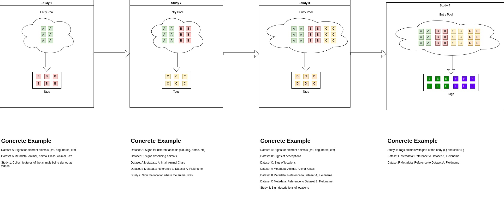

# Dataset

## Summary

Datasets are a way of keeping track of different groups of entries. Below is an example workflow within SignLab and how the
concept of datasets comes into play.

In the example above, an admin user uploaded a set of entries `A`. From entries `A`, `B` was collected. `A` and `B` represent different kinds of data so should be considered as different kinds of entities. That is where datasets come into play. The datasets allow the end user to keep track of different kinds of entries in a SignLab instance.

Datasets can be created when an admin uploads new entries or when entries are being collected as part of a study. Datasets can be added to via uploading by an admin user.
